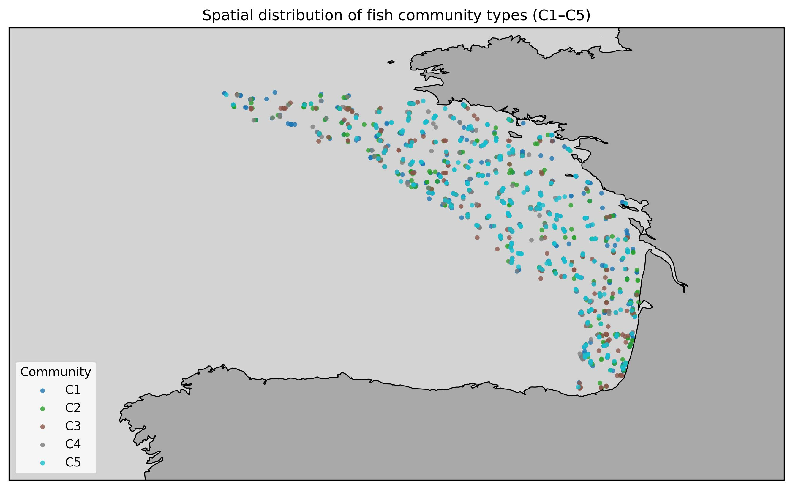
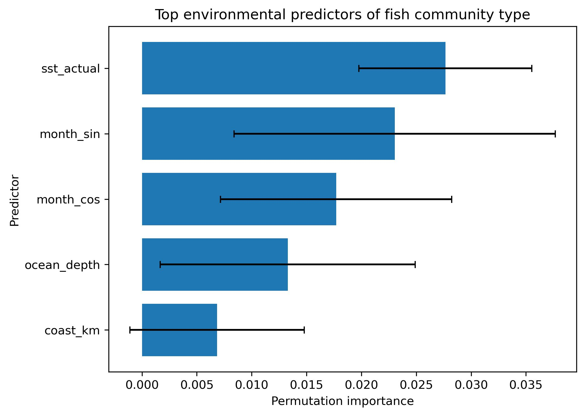

# Fishes of the Bay of Biscay — Community Modelling

*A portfolio project combining marine ecology and spatial machine learning (K-Means + spatially blocked Random Forest) to understand fish community patterns in the Bay of Biscay.*


**Ecology × ML portfolio project.** I built spatial–temporal–depth “cells”, derived a Hellinger-transformed community matrix, clustered **5 fish community types (C1–C5)** with K-Means, then trained a **spatially blocked Random Forest** to predict community type from environment.

**Performance:** accuracy ≈ **0.39**, macro-F1 **0.357** (↑ from 0.317 baseline).  
**Top drivers:** `sst_actual`, `ocean_depth`, `coast_km`, `chl`.

<p align="center">
    
</p>

## Highlights
- **5 communities (C1–C5)** with clear spatial/seasonal structure.
- **Spatial cross-validation (GroupKFold)** to reduce leakage across space.
- **Interpretability**: permutation importances, partial dependence, and MDS of predictor space.

<p align="center">
  <br/>
</p>

## Workflow (Ecology × ML)
1. **Cells & community matrix** 
— Built spatial–temporal–depth cells; computed species-level community matrix and applied **Hellinger transform**.
2. **Unsupervised structure** 
— **K-Means → 5 communities (C1–C5)** to capture dominant assemblage patterns.
3. **Supervised prediction** 
— **Random Forest** predicts community_type from environment with **spatial-block CV (GroupKFold)** to reduce spatial leakage.
4. **Model tuning & baseline** 
— Grid search around RF hyperparams; compared to a stratified baseline.
5. **Interpretation** 
— **Permutation importances** (drivers: `sst_actual`, `month_sin/cos`, `ocean_depth`, `coast_km`, `chl`) and **class-wise PDPs** (not all shown here to keep the README lean).

## Key Results
| Item | Value |
|---|---|
| Communities discovered | **5 (C1–C5)** |
| CV scheme | **GroupKFold** (spatial blocks) |
| Final model | **Random Forest** (tuned) |
| Accuracy | **≈ 0.39** |
| Macro-F1 | **0.357** *(↑ from 0.317 baseline)* |
| Top predictors | `sst_actual`, `month_sin`, `month_cos`, `ocean_depth`, `coast_km`, `chl` |

> Visuals above: community map (ecological pattern) and permutation importance (drivers).

## Reproducibility
- **Environment**
  ```bash
  conda env create -f environment.yml
  conda activate github-fish-biscay
  jupyter lab

## Author
Theo Murphy
